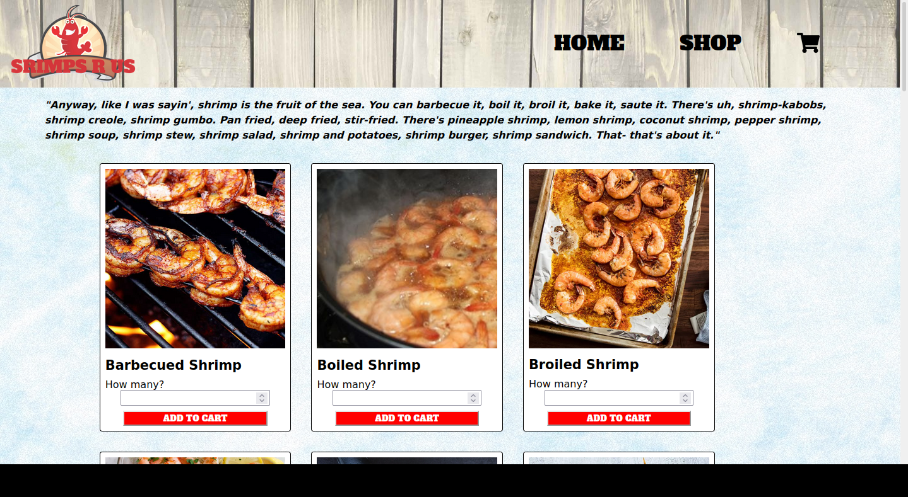

# Readme
# React Shrimps R Us

## Overview

This is a Forrest Gump inspired shopping cart app.  It implements routes via react-router-dom to allow navigation between pages while always showing the navigation bar.  

### Challenge

See the complete design requirements [here](https://www.theodinproject.com/paths/full-stack-javascript/courses/javascript/lessons/shopping-cart).

### Screenshot

  

### Links

- [Live site](https://mattdimicelli.github.io/shopping-cart/#/)
- [Repo](https://github.com/mattdimicelli/shopping-cart)

## My process

### Built with

- React via create-react-app
- React functional components with hooks
- react-router-dom
- JSX
- uniqid

### What I learned

When a app has multiple pages (so it is not a SPA), one must have a reliable
routing system to ensure that each component or page is rendered when surfing
to a specific route.  
React-router-dom is a package which can be installed to do this.  `<Route>` is imported
and contains a URL path and a component that should be rendered upon navigating
to that URL.  In the case of this app, `<HashRouter>` was also imported.  Although
in the React Router documentation it states that  `<HashRouter>` is only intended
to support legacy browser, it is used here instead of `<BrowserRouter>` to avoid
getting a 404 upon page refresh, since that is a quirk of hosting that app on 
Github Pages.  There are other routers that could be used in different circumstances.
The `<Switch>`, also imported, renders the first child `<Route>` that matches the location, which prevents multiple matching `<Route>` from being
rendered simultaneously.  
